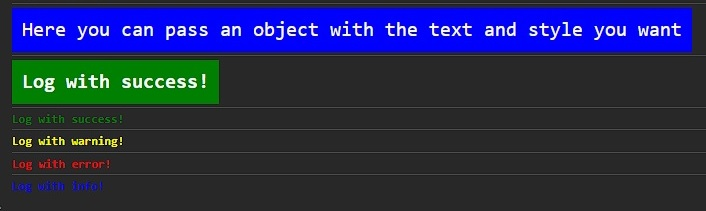

# react-debulog

`react-debulog` is a versatile and customizable logging library for React applications, allowing you to enhance your debugging and logging capabilities with ease.

## Installation

To install `react-debulog`, you can use npm or yarn:

```bash
npm install react-debulog
```

or

```bash
yarn add react-debulog
```

## Usage

Import the library and its functions into your React component file:

```jsx
import { useEffect } from 'react';
import {
  logError,
  logInfo,
  logSuccess,
  logWarning,
  logCustom,
} from './debulog';

function App() {
  // Examples of logs with different styles
  useEffect(() => {
    logCustom({
      text: 'Here you can pass an object with the text and style you want',
      style: {
        color: 'white',
        backgroundColor: 'blue',
        padding: '10px',
        fontSize: '20px',
      },
      // Here you can pass an object or a string, and it will be displayed in the console
    });

    // The logs below are the defaults, but you can pass the text and style you want
    logSuccess(
      {
        text: 'Log with success!',
        style: {
          color: 'white',
          backgroundColor: 'green',
          padding: '10px',
          fontSize: '20px',
        },
      }
      // Here you can pass an object or a string, and it will be displayed in the console
    );
    logSuccess('Log with success!');
    logWarning('Log with warning!');
    logError('Log with error!');
    logInfo('Log with info!');
  }, []);

  return <></>;

  export default App;
}
```

## Customization

You can customize the styles of the logs by passing the styles you want in the style object.

```jsx
export interface StylesPropsDebulog {
  color?: string;
  border?: string;
  padding?: string;
  margin?: string;
  fontSize?: string;
  fontWeight?: string;
  fontStyle?: string;
  textDecoration?: string;
  backgroundColor?: string;
  [key: string]: string | undefined;
}

// example
logSuccess({
  text: 'Log with success!',
  style: {
    color: 'white',
    backgroundColor: 'green',
    padding: '10px',
    fontSize: '20px',
    // Here you can pass the styles you want
  },
});
```

## Preview



# Contribution Guide

Welcome to the project! We're delighted that you want to contribute. This guide will walk you through how to do so effectively.

## Author and Contributors

This project is maintained by [Gustavo Bacellar](https://github.com/gustavobacellarladeira).

If you would like to contribute to this project, please follow the [Contribution Guidelines](#passos-para-contribuir).

## Contribution Guidelines <a name="steps-to-contribute"></a>

1. **Fork the Repository**

   Click the "Fork" button in the top right corner of this page to create a copy of the repository in your own GitHub account.

2. **Clone the Repository**

   Clone your fork locally to your machine:

   ```bash
   git clone https://github.com/gustavobacellarladeira/react-debulog.git
   ``
   ```

# Support Our Project

<!--
[](https://www.paypal.com/donate/?hosted_button_id=87BW8CA5UEGTL) -->

## Why Donate?

Our project is powered by the generous support of people like you. Your donations help us continue our mission and make ongoing improvements.

## How You Can Help

- Click the "Donate" button above to make a quick and secure donation.
- Consider a monthly donation to support the project continuously.
- Share our project with friends and family to expand our reach.

## Your Support Makes a Difference

Every donation, no matter how small, makes a significant impact on our project. We deeply appreciate your ongoing support.

[](https://www.paypal.com/donate/?hosted_button_id=87BW8CA5UEGTL)

## License

This project is licensed under the [MIT](https://choosealicense.com/licenses/mit/) License - see the LICENSE file for details.
